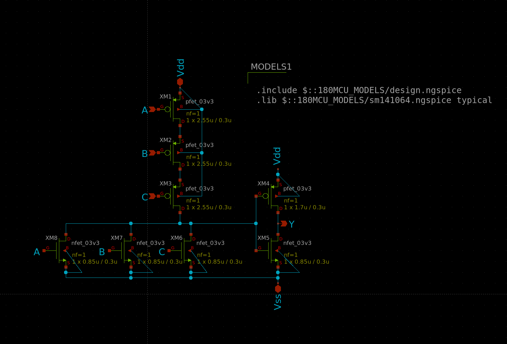
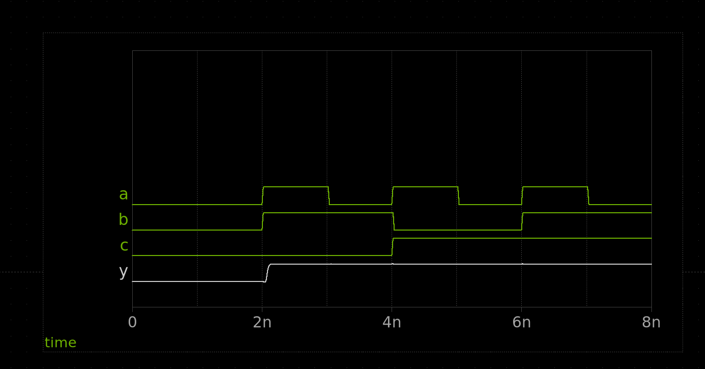
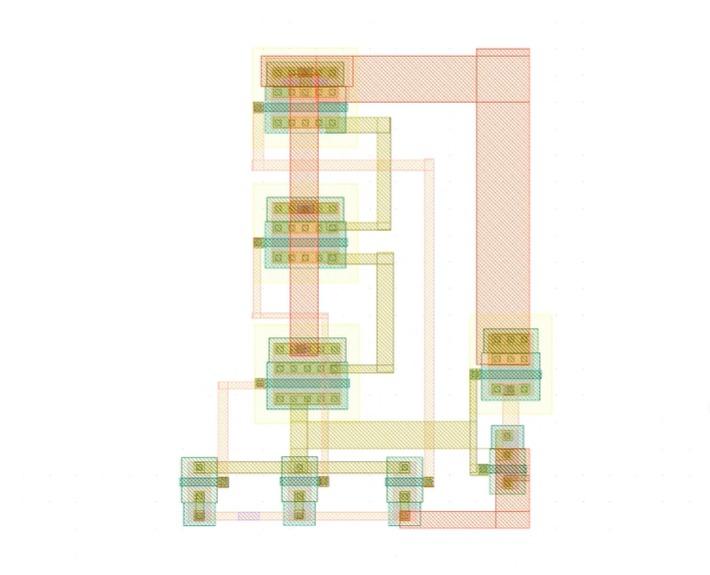

# DOCUMENTATION

This is the 3 input OR gate with drive strength 1

Our schematic uses width 2.55u as we want to reduce the effective resistance of the pull up network and maintain the propogation delay. For the Length we are sticking to the ones already present in the OSU library.

Here is the Functional Form:

These are the Static power table followed by Propogation delay. THe table is based exactly on how the official documentation.

# Static Power

# Propogation Delay, We have added Rise and Fall times as well

# Layout (Subject to change)

The area for the above layout comes out to be around ~304 micron^2
